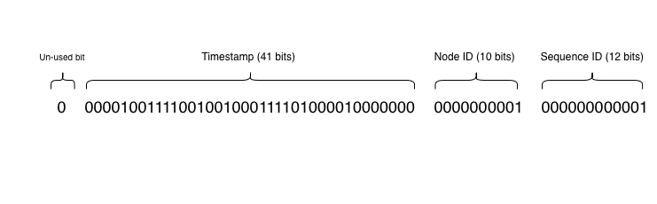

# DSL Common Library

Core distributed system utilities shared across the `distributed-systems-lab` microservices.

## 1. Snowflake ID Generator
A distributed unique ID generator inspired by Twitter's Snowflake algorithm.

### Why Snowflake?

| Feature               | **Snowflake ID**            | **UUID (v4)**            | **DB Auto-Increment**   | **Redis `INCR`**       |
|:----------------------|:----------------------------|:-------------------------|:------------------------|:-----------------------|
| **Generation**        | Local (No Network)          | Local (No Network)       | Central (Network Call)  | Central (Network Call) |
| **Sortable?**         | Yes (Time-ordered)          | No (Random)              | Yes                     | Yes                    |
| **Size**              | 64-bit (Small)              | 128-bit (Large)          | 64-bit (Small)          | 64-bit (Small)         |
| **Index Performance** | **Excellent** (Append-only) | **Poor** (Fragmentation) | Excellent               | Excellent              |
| **Coordination**      | Low (Node ID config)        | None                     | High (Locks)            | High (Single Thread)   |
| **Collision Risk**    | Zero (if clock stable)      | Near Zero                | Zero                    | Risk if data lost      |

### Bit Layout (64-bit *long*)
The ID is composed of 64 bits, allowing for time-sorting and distributed generation.



### Handling Clock Drift (NTP)
Distributed systems rely on NTP, which can sometimes move the system clock backwards to sync with the global time. This creates a risk of generating duplicate IDs.

#### Resolution Strategy (Patient Wait): 
If the drift is small, the thread pauses (sleeps) until the clock catches up to the last generated timestamp. This prevents service outages during minor NTP adjustments.

### Code Usage
```java
// Initialize with Node ID (must be unique per server instance)
SnowflakeIdGenerator generator = new SnowflakeIdGenerator(1);

// Generate ID
long id = generator.nextId(); 
// Output: 839281920192
```

## 2. Base62 Encoder
A high-performance utility for converting unique numeric IDs into short strings with only `[0-9, a-z, A-Z]`.

### The Base Conversion Math:
Direct mathematical conversion between Base10 (Decimal) and Base62.
* **Encode:** ID $\rightarrow$ String (e.g., `1024` $\rightarrow$ `"g8"`)
* **Decode:** String $\rightarrow$ ID (e.g., `"g8"` $\rightarrow$ `1024`)

### Usage:
```java
String shortUrl = Base62Encoder.encode(178263819283046400L); 
// Output: "darUvlwGyI"

long originalId = Base62Encoder.decode("darUvlwGyI");
// Output: 178263819283046400
