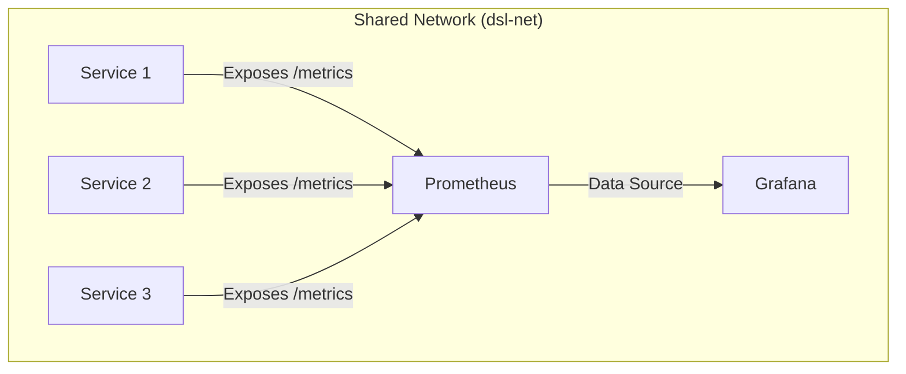

# DSL Observability & Infrastructure

This module serves as the **Central Nervous System** for the Distributed Systems Lab. It provides a unified observability stack and shared infrastructure networking, ensuring all microservices report metrics in a consistent, standardized format.

## Purpose
1.  **Infrastructure Hub:** Hosts the central **Prometheus** and **Grafana** containers and manages the shared Docker network (`dsl-net`).
2.  **Shared Library:** A lightweight Java library that configures **Micrometer** with standard tags (`env`, `service`, `region`), ensuring data consistency across all services.

## Architecture

The system follows a **Pull-Based** monitoring architecture. Applications expose a `/metrics` endpoint, and the central Prometheus server scrapes them over the shared internal network.


## Run This First!
Since this module manages the shared network (`dsl-net`), you must start this stack before running any other microservice.
```Bash
    docker-compose up -d
```
1. Boot the Infrastructure
   - Creates the `dsl-net` bridge network. 
   - Starts Prometheus (Port `9090`). 
   - Starts Grafana (Port `3000`).

2. Access Dashboards
   - Grafana: http://localhost:3000
     - User: `admin`
     - Password: `admin`
   - Prometheus Target Status: http://localhost:9090/targets

## Integration Guide
To add observability to a new microservice, follow these steps:

### 1. Add Maven Dependency
Add the module to your `pom.xml`. This transitively pulls in `micrometer-registry-prometheus`.
```xml
<dependency>
    <groupId>com.dsl</groupId>
    <artifactId>dsl-observability</artifactId>
    <version>1.0-SNAPSHOT</version>
</dependency>
```

### 2. Use the Shared Registry
Instead of creating a new registry, use the singleton instance. This ensures standard tags are applied automatically.
```java
private final PrometheusMeterRegistry registry = DslMetrics.getInstance();
```

### 3. Expose the Endpoint
Your HTTP server must expose the scraped data.

### 4. Register in Prometheus
Add your service to prometheus.yml:
```yml
scrape_configs:
  - job_name: 'my-new-service'
    metrics_path: '/metrics'
    static_configs:
      - targets: ['container-name:port']
```