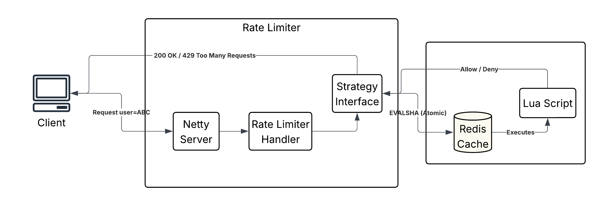

# Distributed Rate Limiter Service

A high-performance, distributed middleware service designed to protect downstream services (like url-shortener) from abuse and traffic spikes.

It implements a **Inter-changeable Strategy Pattern**, allowing you to hot-swap rate-limiting algorithms (Token Bucket, Sliding Window, etc.) without changing the core application logic. The logic is executed in **Redis** using **Lua scripts** to ensure atomicity across distributed nodes.

## Key Features
* **Atomic Operations:** All logic is pushed to **Redis Lua Scripts**. This eliminates "Check-Then-Act" race conditions common in distributed systems.
* **Pluggable Algorithms:** Supports multiple strategies via a Factory pattern:
    * **Token Bucket:** Allows traffic bursts while maintaining an average rate.
    * **Leaking Bucket:** Smooths out traffic to a constant flow.
    * **Sliding Window Counter:** A memory-efficient approximation of the sliding window.
    * **Sliding Window Log:** Logs timestamps to get accurate counts.
    * **Fixed Window:** Simple counter (reset at fixed intervals).
* **Resilience:** Implements a **Fail-Open** Circuit Breaker. If Redis goes down, traffic is allowed to preserve user experience.
* **Observability:** Fully instrumented with **Micrometer** and **Prometheus** (RED Method).

---

## Tech Stack

* **Language:** Java 21 (Temurin)
* **Server:** Netty server
* **Storage:** Redis (Lettuce Driver)
* **Scripting:** Lua (Server-side scripting)
* **Metrics:** Prometheus, Grafana
---

## Architecture

## Supported Algorithms
The service is designed to be algorithm-agnostic. The currently active algorithm is loaded at startup via RateLimiterFactory.

| Algorithm                   | Best For          | Pros                                    | Cons                                      |
|:----------------------------|:------------------|:----------------------------------------|:------------------------------------------|
| **Token Bucket**            | API Rate Limiting | Allows short bursts; memory efficient 	 | Complex to tune refill rates              |
| **Leaking Bucket**          | Packet Shaping    | Enforces constant outflow rate          | Bursts can cause queue drops              |
| **Fixed Window**            | Basic Protection  | Simple; low CPU usage                   | "Edge case" spikes (2x limit at boundary) |
| **Sliding Window Log**      | Precision         | 100% accurate rolling window            | Expensive RAM (stores every timestamp)    |
| **Sliding Window Counter**  | Balanced          | Good approximation; low RAM             | Slightly less precise than logs           |

## Observability
This service automatically reports metrics to the central DSL Observability stack.
- Metric Name: `ratelimiter.requests`
- Tags: result=`allowed`, result=`blocked`
- Latency: `ratelimiter.check.duration`

Access the Grafana Dashboard at http://localhost:3000 to visualize the Block Rate.
