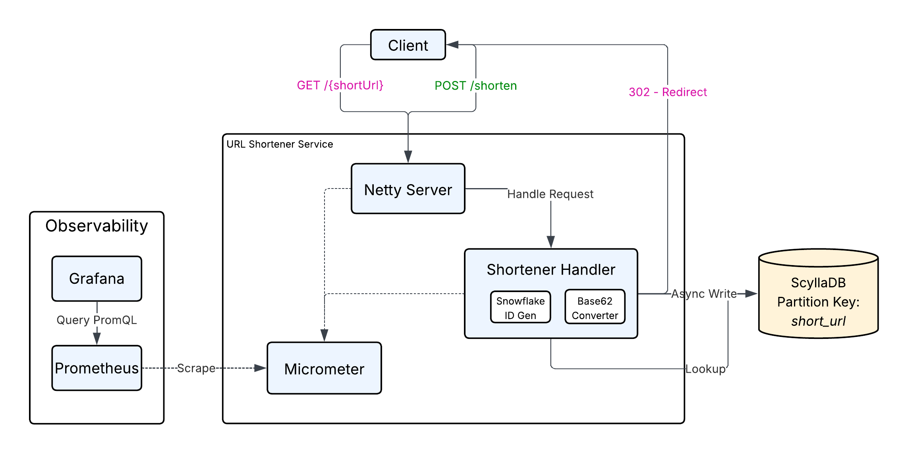
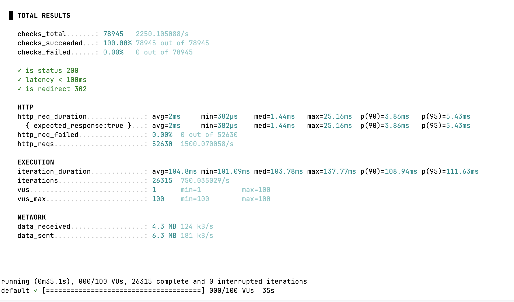
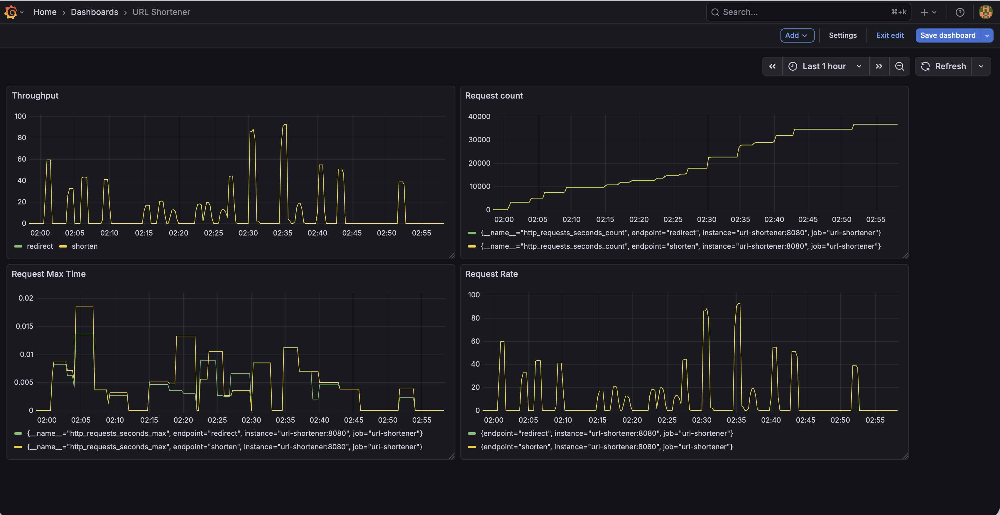

# High-Performance Distributed URL Shortener

A high-throughput, low-latency URL Shortener service built from scratch in Java. It bypasses high-level frameworks (Spring Boot) in favor of **Raw Netty** and **ScyllaDB** to achieve maximum concurrency and minimal resource overhead.

## Functional Requirements
* **Shorten URL:** The system must accept a valid long URL and return a unique shortened alias.
* **Redirection:** Accessing the shortened alias must redirect the user to the original long URL via HTTP 302.
* **Uniqueness:** Every generated Short URL must be globally unique.
* **Idempotency:** *Design Choice: Submitting the same URL twice results in two different short links.*
* **Base62 Encoding:** Short URLs must use alphanumeric characters `[a-z, A-Z, 0-9]` for URL safety.

## Non-Functional Requirements
* **Low Latency:**
    * **Write (Shorten):** < 10ms (ID generation is local; DB write is async/fast).
    * **Read (Redirect):** < 10ms (P99).
* **High Throughput:** The system should handle thousands of requests per second (RPS) on a single node.
* **Scalability:**
    * **Application:** Stateless design allows horizontal scaling behind a load balancer.
    * **Database:** ScyllaDB allows horizontal scaling by adding nodes to the cluster.
* **Durability:** Data is persisted to disk immediately; no in-memory data loss risks.

## Key Features

* **Non-Blocking I/O:** Built on **Netty 4** using the Event Loop model (Reactor Pattern) for handling thousands of concurrent connections.
* **Distributed ID Generation:** Uses a custom **Snowflake ID Generator** (no coordination required between nodes).
* **High-Performance Storage:** Uses **ScyllaDB** for scalable, key-value persistence.
* **Observability:** Built-in **Prometheus** metrics and **Grafana** dashboards ([RED Method](https://grafana.com/blog/2018/08/02/the-red-method-how-to-instrument-your-services/)).

## Tech Stack

* **Language:** Java 21
* **Networking:** Netty (Raw NIO)
* **Database:** ScyllaDB (NoSQL)
* **Observability:** Micrometer, Prometheus, Grafana
* **Testing:** JUnit 5, Mockito, k6 (Load Testing)
* **Containerization:** Docker, Docker Compose

---

## Architecture Design

### 1. Write Path (`POST /shorten`)
1.  **Request:** Client sends `original_url`.
2.  **ID Generation:** Server generates a unique 64-bit ID using the **Snowflake Algorithm** (Local CPU operation, 0ms latency).
3.  **Encoding:** ID is converted to a Base62 String (e.g., `17826...` $\rightarrow$ `7Xw9b2`).
4.  **Persistence:** The mapping (`short_url` $\rightarrow$ `original_url`) is persisted in **ScyllaDB**.
5.  **Response:** Client receives the short URL immediately.

### 2. Read Path (`GET /{shortUrl}`)
1.  **Request:** Client hits the short link.
2.  **Lookup:** Server queries ScyllaDB by Partition Key (`short_url`).
3.  **Redirect:** Server returns a `302 Found` with the `Location` header.



---

## Getting Started

### Prerequisites
* Docker & Docker Compose
* Java 21 (Optional, if running outside Docker)

### Run the Full Stack
This spins up the App, ScyllaDB, Prometheus, and Grafana as docker containers.

```bash
    cd java/dsl-observability
    docker-compose up --build
    cd java/url-shortener
    docker-compose up --build
```

### API Endpoints
The API Endpoints are available here for [test](src/main/resources/test.http).

## Observability & Load Testing
### Run a Load Test (k6)
We use **_k6_** to simulate high traffic. The script handles both Write (Shorten) and Read (Redirect) traffic.
Load test script folder location: [load-test](load-test)



### View Metrics (Grafana)
* URL: http://localhost:3000
* Credentials: admin / admin
* Dashboard Setup:
  * Add Data Source → Prometheus (http://prometheus:9090)
  * Import Dashboard from [grafana-dashboard.json](grafana-dashboard.json).



